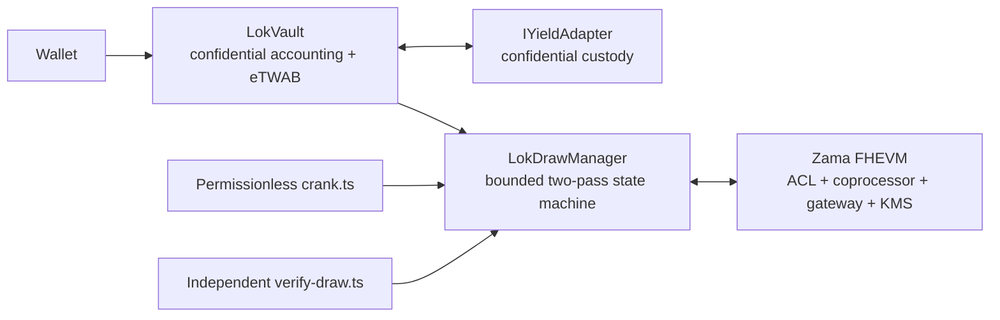
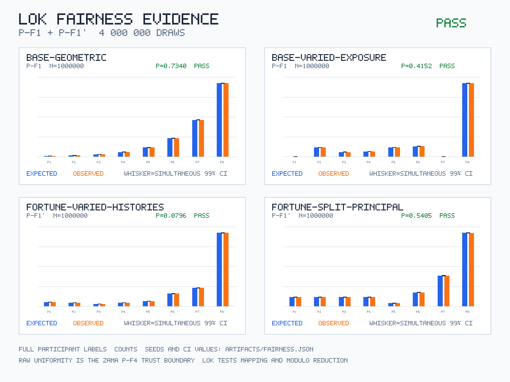

# Lok Protocol

Confidential prize-linked savings on Zama FHEVM: principal stays withdrawable, balances and odds stay encrypted, and
only aggregate draw evidence becomes public.

## 1. Live Demo And Sepolia Deployment

- **Live demo:** [lok-protocol.vercel.app](https://lok-protocol.vercel.app)
- **Source repository:** [github.com/duclucky/lok-protocol](https://github.com/duclucky/lok-protocol) (private until
  submission publication)
- **Vercel project:** `lok-protocol-app` (Git-connected; root directory `frontend/`)
- **Network:** Ethereum Sepolia (`11155111`)
- **Video:** human recording and public link are required before submission
- **Evidence status:** preserved demo stack has settled draws; latest public verifier target is draw `#2` with a
  31-participant snapshot
- **Demo verifier manifest:** `deployments/history/sepolia-2026-08-13-120-30-180-600.json`. The canonical
  `deployments/sepolia.json` is the later P-S2 minimum-timing evidence stack and is intentionally not seeded.

| Verified contract          | Sepolia address                                                                                                                      |
| -------------------------- | ------------------------------------------------------------------------------------------------------------------------------------ |
| Mock USDC                  | [`0x68e13782C114A885f754109EF99Cea269eb401b2`](https://sepolia.etherscan.io/address/0x68e13782C114A885f754109EF99Cea269eb401b2#code) |
| Confidential cUSDC wrapper | [`0x00eB52CF8f64eA64588BB0d427EE93A907Dbe107`](https://sepolia.etherscan.io/address/0x00eB52CF8f64eA64588BB0d427EE93A907Dbe107#code) |
| MockYieldAdapter           | [`0xB0FDA68126fC09DED8A7114ad436f2B638D89dfA`](https://sepolia.etherscan.io/address/0xB0FDA68126fC09DED8A7114ad436f2B638D89dfA#code) |
| LokVault                   | [`0xAA7B956c551B7f5336c2d9e786CB9024aB1657e1`](https://sepolia.etherscan.io/address/0xAA7B956c551B7f5336c2d9e786CB9024aB1657e1#code) |
| LokDrawManager             | [`0x5592dB13624EB5C20B6Bb5841317148c79DFFAa5`](https://sepolia.etherscan.io/address/0x5592dB13624EB5C20B6Bb5841317148c79DFFAa5#code) |

## 2. Specification Compliance

| Requirement                                   | Evidence                                                                           |
| --------------------------------------------- | ---------------------------------------------------------------------------------- |
| R1 - shared pool                              | `test_R1_SharedPool_MultipleDepositorsSingleVault`                                 |
| R2 - yield awarded through periodic draws     | `test_R2_SpecExact_AllPoolYieldAwardedAsPrizes`                                    |
| R3 - principal withdrawable in every state    | `test_R3_WithdrawPrincipal_AnyState`                                               |
| R4 - encrypted deposits, balances and credits | `test_R4_EndToEndEncrypted_NoPlaintextAmountInAnyEvent`                            |
| R5 - no public per-user odds                  | `test_R5_PerUserOdds_NeverPubliclyDecryptable`                                     |
| R6 - winner not exposed                       | `test_R6_WinnerIndistinguishableFromLoser`                                         |
| R7 - encrypted winner selection               | `test_R7_WinnerSelection_OperatesOnEncryptedBalances`                              |
| R8 - only winner decrypts a non-zero prize    | `test_R8_OnlyWinnerDecryptsNonZeroPrize`                                           |
| R9 - publicly verifiable draw                 | `test_R9_DrawPubliclyVerifiable_InvariantHolds` and `scripts/verify-draw.ts`       |
| R10 - Sepolia                                 | `test/integration/SepoliaDeployment.t.ts`                                          |
| R11 - contract and frontend code              | `contracts/` and `frontend/` build/test gates                                      |
| R12 - public website                          | production smoke test recorded in `docs/DEPLOYMENT.md`                             |
| R13 - three-minute real-person video          | human-only delivery item; script in `docs/VIDEO-SCRIPT.md`                         |
| R14 - X thread/article                        | human-only delivery item; draft in `docs/X-THREAD-DRAFT.md`                        |
| R15 - submit by deadline                      | target `2026-09-03`, ahead of `2026-09-05 23:59 AOE`                               |
| R16 - production-quality work                 | frozen proofs, adversarial tests, HCU benchmark, verified deployment and public UI |

The full mapping and the human-only eligibility checks are in
[`docs/01-bounty-compliance.md`](docs/01-bounty-compliance.md).

## 3. Specification Interpretation

Lok treats the prize amount as public while keeping its recipient and every per-user amount encrypted. This preserves a
public conservation check without publishing who won. The default encrypted risk setting is `theta = 100%`, so an
untouched account routes all of its yield contribution to the prize draw exactly as the bounty specification requests.
The Risk Dial is an opt-in extension. A variant with an encrypted prize amount is possible, but it would remove the
current public prize-conservation evidence and is outside this frozen design.

## 4. Why Confidentiality Is the Product

Prize-linked savings already works at national scale. NS&I reported GBP 134.6 billion of eligible Premium Bonds at the
end of 2025 and GBP 4.95 billion of prizes during that year. Its product lets savers check their own result rather than
publishing a wallet-level winner graph
([NS&I 2025 figures](https://nsandi-corporate.com/news-research/news/premium-bonds-2025-year-figures)).

On-chain prize savings has the opposite default. PoolTogether describes a protocol that has distributed more than $10
million in prizes, while its user guide also says draw history can show who won
([PoolTogether overview](https://docs.pooltogether.com/welcome),
[PoolTogether FAQ](https://docs.pooltogether.com/welcome/faq)). Public settlement is useful for auditability, but public
winner identity turns every result into permanent financial metadata.

Lok separates verification from disclosure. FHEVM evaluates balances, risk settings, ranges and credits while they are
ciphertexts. The protocol publishes aggregate totals needed to verify conservation and lets each participant privately
decrypt only their own result. Confidentiality is therefore the mechanism that makes the product socially private, not a
cosmetic wrapper around a transparent draw.

## 5. The Three Mechanisms

**Risk Dial.** Each saver stores an encrypted `theta` from 0% to 100%. It controls how much of that saver’s yield share
enters prize weighting; nobody can publish or compare individual settings. A private preference could not be enforced
on-chain without encrypted computation.

**Encrypted time-weighted average balance (eTWAB).** Lok accumulates encrypted balance-time and balance-time-risk at
user action time, then freezes the exact value at draw end. This prevents last-second deposits from buying a full period
of odds without revealing balances or per-user weights.

**Quiet Win.** PASS B writes one encrypted credit for every participant. The winner receives the encrypted prize and
everyone else receives encrypted zero through the same function, event shape and ACL pattern. A winner-only claim or ACL
grant would identify the winner publicly.

## 6. Architecture



The draw is paginated. PASS A snapshots participants, builds encrypted aggregate weights and publicly decrypts only the
allowlisted totals. The resulting plaintext denominator permits reduction of encrypted randomness. PASS B carries an
encrypted prefix across bounded transactions, tests half-open intervals with `FHE.select`, and credits every participant
uniformly.

The naive algorithm fails three ways: a sequential encrypted sum hits transaction depth at roughly 30 participants;
encrypted divisors make `r mod encryptedTotal` unavailable; and encrypted comparisons cannot control Solidity branches.
Weighted reservoir sampling and Gumbel/A-Res require encrypted division or logarithms, so they do not solve those
constraints. Write-time accumulation, aggregate-only decryption and pagination do.

## 7. HCU Benchmark

The current contracts were measured on Sepolia on `2026-08-12`; Gate 3 passed. Caps are 60% of the largest successful
batch, rounded down. Numeric principal, liability and custody values are never exposed for this measurement or for
solvency: production exposes only a proof-bound aggregate boolean checkpoint.

| Path                       | HCU / participant | Max success | Frozen 60% cap |
| -------------------------- | ----------------: | ----------: | -------------: |
| User pre-sync              |         2,430,032 |           8 |              4 |
| PASS A                     |         3,001,192 |           6 |              3 |
| PASS B                     |         4,025,320 |           4 |              2 |
| Strict randomness          |         1,211,000 |          16 |              9 |
| Fortune update             |           294,128 |          67 |             40 |
| Aggregate solvency boolean |           476,000 |          42 |             25 |

| Participants | Pre-sync tx | PASS A tx | PASS B tx | Variable total |
| -----------: | ----------: | --------: | --------: | -------------: |
|           10 |           3 |         4 |         5 |             12 |
|          100 |          25 |        34 |        50 |            109 |
|        1,000 |         250 |       334 |       500 |          1,084 |

Fixed open, aggregate submission, randomness/reveal and settlement transactions are excluded. Improvement paths are:
adopt `FHE.sum` after the compatible Solidity/plugin stack exposes it; use higher-throughput coprocessors; raise
governance-configured HCU ceilings as the network permits; and parallelize independent batches while retaining PASS A
ordering. Raw HCU, gas, latency and transaction hashes are in [`docs/BENCHMARK.md`](docs/BENCHMARK.md) and
[`artifacts/hcu-benchmark.json`](artifacts/hcu-benchmark.json).

## 8. Fairness Evidence

The deterministic Monte Carlo campaign ran 2,000,000 draws across base and Fortune-adjusted scenarios. Every positive
weight category fell inside simultaneous 99% Bonferroni intervals; representative chi-square upper-tail p-values were
`0.7340` and `0.4152`. Zero-weight users never won, interval boundaries passed, and the Fortune split test stayed within
the frozen rounding margin. The trust boundary is explicit: tests verify winner mapping under uniform 64-bit inputs;
uniformity of `FHE.rand` is a Zama platform assumption.



Machine-readable evidence: [`artifacts/fairness.json`](artifacts/fairness.json).

## 9. Winner Privacy: Uniform ACL Grants

Granting decryption access only to the winner would publish the winner through the public ACL footprint. Lok instead
grants each participant access to that participant’s own encrypted credit. One credit is non-zero; all others are
encrypted zero. There is no `claimPrize` or winner-only function, and winner/loser settlement uses the same call, event,
gas and HCU shape.

The privacy campaign passes the machine-checkable log, ACL, ABI, public-decryption allowlist, anonymity-floor and
Fortune channels. The P-P9 UX half remains a human review obligation because identical relayer-visible interaction is a
frontend discipline, not a Solidity theorem. See [`artifacts/privacy-report.json`](artifacts/privacy-report.json) and
[`docs/08-threat-model.md`](docs/08-threat-model.md).

## 10. Path To Production

`IYieldAdapter` isolates confidential custody, withdrawal and realized-yield harvesting from vault accounting. The
Sepolia release deploys `MockYieldAdapter` with a test-only funded-yield source so reviewers can inspect a complete
draw.

`MorphoVaultAdapter` is a reviewed target boundary, not an implemented or deployed contract in this repository. It may
only be added when a yield venue can accept and return the confidential asset without exposing per-user or aggregate
numeric principal. If an integration requires plaintext custody amounts, it is incompatible with Lok’s frozen privacy
and solvency model. Adapter activation is timelocked, IDLE-only and followed by a fresh aggregate boolean solvency
checkpoint. Yield-source failure remains depositor risk.

## 11. Threat Model

The complete threat model is [`docs/08-threat-model.md`](docs/08-threat-model.md). Lok explicitly does not defend
against:

- a compromised user wallet;
- network-level surveillance that links an IP address to a decryption request;
- voluntary disclosure, including the irreversible proof-of-win feature;
- statistical inference from a very small participant pool;
- failure of the underlying yield source;
- regulatory action against confidential financial applications; or
- correlation with off-chain data the protocol cannot observe.

This is a prize-linked savings research system, not legal or financial advice. Commercial deployment requires
jurisdiction-specific review.

## 12. Failure Paths

`withdraw`, `withdrawAll`, `exit`, `setTheta`, deposit and `emergencyWithdraw` remain callable throughout draw states.
If the public-decryption oracle is silent before any funded credit, anyone can call `abortDraw` after the timeout and
the machine clears draw-local state. Once PASS B writes the first funded credit, abort is disabled and permissionless
cranking must finish settlement so partial awards cannot be discarded.

Emergency recovery does not wait for randomness, keepers or the public-decryption oracle. Adapter swaps are IDLE-only,
timelocked and preserve exits throughout. A false aggregate solvency checkpoint restricts new risk transitions; it does
not publish the numeric assets/liabilities and does not block principal recovery.

## 13. Run It Locally

Prerequisites: Node.js 22, npm, and Java 21 only when re-running TLC. From a clean clone:

```bash
npm ci
npm run compile
npm test
npm --prefix frontend ci
npm --prefix frontend run test
npm --prefix frontend run build
```

Run the UI:

```bash
npm --prefix frontend run dev
```

The Foundry defaults in `foundry.toml` are intentionally small (`64` invariant runs, shallow depth) for local smoke
checks. They are not the tier-A evidence. Reproduce the audited sharded campaign with the PowerShell runner:

```powershell
.\scripts\run-invariants.ps1 -Campaign all -Sequences 10000000 -Depth 32 -ShardsPerCampaign 28 -ThreadsPerShard 1
```

The runner writes `artifacts/invariants/{safety,fairness,summary}.json`, records the Git commit hash, and includes the
actual sequence and call counts parsed from Forge. It rejects a dirty worktree and retains each shard's raw
stdout/stderr as `.txt` files with SHA-256 hashes in the shard metadata. Re-parse and validate the committed evidence
independently with:

```powershell
.\scripts\collect-invariants.ps1 -Sequences 10000000 -Depth 32 -ShardsPerCampaign 28
```

The safety selector set must include `settleDraw`; `directCredit` alone is not settlement evidence.

Sepolia deployment, keeper, verifier and benchmark commands require local secret variables described in
[`docs/11-tooling.md`](docs/11-tooling.md). No private key, mnemonic or provider API key belongs in the repository.
Deployment evidence and the final settled-draw gate live in [`docs/DEPLOYMENT.md`](docs/DEPLOYMENT.md). Verify the
preserved settled demo draw with:

```powershell
$env:LOK_VERIFY_MANIFEST="deployments/history/sepolia-2026-08-13-120-30-180-600.json"
$env:LOK_VERIFY_LATEST_SETTLED="1"
npx --yes node@22 node_modules/hardhat/internal/cli/cli.js run scripts/verify-draw.ts --network sepolia
```

## 14. Demo Components

The production logic is `LokVault`, `LokDrawManager` and `IYieldAdapter`. The following surfaces exist only to make the
Sepolia demonstration or measurement reproducible:

- `MockUSDC.mint`, `YieldInjectingERC7984.mintForTest` and `injectYield` create test assets and funded yield.
- `MockYieldAdapter.notifyYield` models a confidential yield source; it is not a production venue.
- `scripts/seed-demo.ts` creates public participant membership with varied encrypted balances and risk settings; its
  ephemeral actor keys are never persisted.
- `HCUProbe`, `SolvencyCheckpointProbe`, `ProbeERC7984` and `ProbeAssetSource` are measurement/API probes.
- `MaliciousConfidentialToken`, `MaliciousYieldAdapter` and `VaultDrawHarness` are adversarial test fixtures.
- `FHECounter` and `deploy/deploy.ts` are retained upstream-template examples and are not part of Lok deployment.
- The public “Get test tokens” control and funded-yield display are demo affordances. They confer no admin power over
  Lok accounting or draw outcomes.

License: [BSD-3-Clause-Clear](LICENSE).
